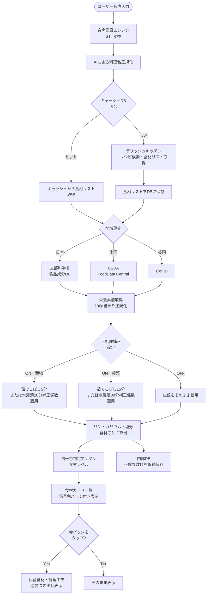
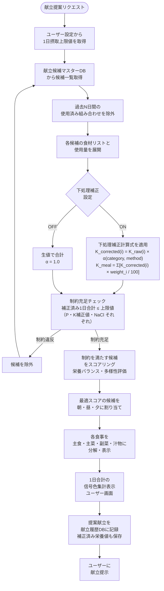
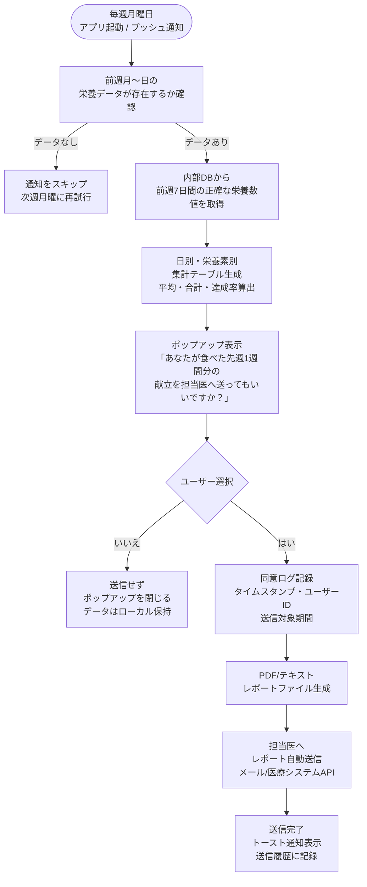

# JURO 要件定義書

**アプリ名：** JURO（寿老人）  
**バージョン：** 1.0  
**作成日：** 2026-04-29  
**対象：** 透析患者向け食事管理アプリ  
**ステータス：** 特許出願準備中

---

## 目次

1. [プロジェクト概要](#1-プロジェクト概要)
2. [ユーザーストーリー](#2-ユーザーストーリー)
3. [機能要件](#3-機能要件)
   - [3.1 献立提案システム](#31-献立提案システム)
   - [3.2 栄養素計算システム](#32-栄養素計算システム)
   - [3.3 担当医レポート機能](#33-担当医レポート機能)
4. [データフロー](#4-データフロー)
5. [技術的独自性（特許出願対応）](#5-技術的独自性特許出願対応)
6. [非機能要件](#6-非機能要件)
7. [将来の拡張性](#7-将来の拡張性)
8. [用語定義](#8-用語定義)

---

## 1. プロジェクト概要

### 1.1 アプリ名・由来

アプリ名「JURO」は、七福神の一柱である**寿老人（じゅろうじん）**に由来する。寿老人は長寿と健康の神であり、慢性疾患を抱える透析患者が日々の食事管理を通じて長く健やかな生活を送るという本アプリの理念と合致する。

### 1.2 対象ユーザー

- 慢性腎臓病（CKD）末期ステージにあり、血液透析または腹膜透析を受けている患者
- 食事制限の指導を受けているが、日常的な栄養管理に困難を感じているユーザー

### 1.3 目的

透析患者は腎機能の低下により、以下の栄養素を厳しく制限する必要がある。

| 栄養素 | 制限理由 |
|--------|---------|
| **リン（P）** | 高リン血症による骨代謝異常・血管石灰化のリスク |
| **カリウム（K）** | 高カリウム血症による心停止リスク |
| **塩分（NaCl）** | 体液過剰・高血圧・心不全リスク |

本アプリは、これら3栄養素の摂取制限を守りながら、食事管理の**心理的・認知的負担を大幅に軽減**することを目的とする。医療数値をユーザーに直接提示せず、視覚的な信号色に変換することで、患者が過度なストレスなく食事判断できる体験を提供する。

### 1.4 管理対象栄養素と信号色定義

本アプリ全体で統一する信号色（トラフィックライト）評価体系：

| 色 | 意味 | 閾値条件（内部） |
|----|------|----------------|
| 緑（安心） | 摂取量が制限値に対して余裕あり | 0〜70%未満 |
| 黄（注意） | 制限値の閾値に近づいている | 70〜100%未満 |
| 赤（超過） | 制限値を超過または超過リスクが高い | 100%以上 |

> **設計方針：** 信号色はユーザー表示専用レイヤー。正確な数値は内部DBに保持し、担当医レポート用途にのみ使用する（二層構造設計）。

### 1.5 設計哲学 — 患者に入力させない

JUROの最大の設計方針は**「患者に入力させないこと」**である。

透析患者の8割以上が70歳以上の高齢者であり、複雑な操作やテキスト入力は現実的でない。わずらわしさを感じると高齢者はすぐに使用をやめてしまうため、**操作の簡潔さがアプリ継続利用の鍵**となる。

この設計哲学はアプリ全体のUI/UX判断の根幹をなし、以下のように体現される：

| 場面 | 入力レス設計の実現方法 |
|------|----------------------|
| 献立の決定 | アプリが自動提案（自分で考えなくていい） |
| 料理の入力 | 音声で話すだけ（タイピング不要） |
| 栄養状態の把握 | 信号色で表示（数値の読み取り不要） |
| 医師へのレポート送信 | 「はい/いいえ」の2択ポップアップ（複雑な操作不要） |
| アレルギー設定 | プリセットから選択（自由入力を最小化） |

> **設計原則：** すべての機能において「ユーザーが何かを入力・記憶・判断する負荷」を最小化すること。JUROが考え、JUROが提案し、ユーザーは選ぶだけ。

### 1.6 アーキテクチャ方針 — サーバーサイド・ロジック分離構成

#### 目的

競合他社によるリバースエンジニアリングを完全に防ぎ、特許技術（核心アルゴリズム）を保護する。

#### 方針1：核心ロジックのブラックボックス化（サーバーサイド実装）

以下の処理はすべて**サーバーサイドで完結**させ、クライアント（アプリ）側には一切持たせない：

- 食材の自動判別（根菜・葉物等の分類）
- 食材分類に基づいた「水への浸漬時間」の動的割当
- 調理工程（茹でこぼし等）に伴う栄養素（リン・カリウム・塩分・水分）の補正演算
- 献立の制約充足チェック・スコアリング

アプリ側は**ユーザーの発話テキストを送信し、サーバーから算出結果（信号色・献立リスト等）を受け取るだけ**の構造とする。

#### 方針2：二系統（ハイブリッド）算出エンジン

APIリクエストに対し、以下の二段階の優先順位でデータを生成する：

| 優先度 | データソース | 説明 |
|--------|------------|------|
| Primary | 内部DB | 確定値（事前に計算・検証済みの栄養データ）を優先参照 |
| Secondary | 外部レシピサイト | 内部DBに該当がない場合、デリッシュキッチン等を動的に解析し材料ごとの栄養素を合算して回答を生成 |

#### 方針3：APIインターフェース設計（秘匿化）

- レスポンスデータは**最小限の確定値のみ**を返す（信号色、料理名、食材名と信号色バッジ等）
- 計算過程・中間値・補正係数・残存率・生値は一切クライアントに返さない
- 計算式やアルゴリズムがクライアント側から推測されない設計とする

---

## 2. ユーザーストーリー

### 献立提案に関するストーリー

**US-01**  
透析患者として、毎日の献立を考える手間を省きたいので、アプリが1日3食の献立を自動提案してくれる機能が欲しい。

**US-02**  
透析患者として、今日の食事が制限値の範囲内かどうか直感的に把握したいので、リン・カリウム・塩分・水分の摂取状況を信号色で確認できる機能が欲しい。数値は見たくない。

**US-03**  
透析患者として、毎日同じ献立にはなりたくないので、アプリが過去の献立と重複しない組み合わせを提案してくれる機能が欲しい。

### 栄養素計算に関するストーリー

**US-04**  
透析患者として、食べたい料理を思いついた時に素早く確認したいので、音声で料理名を入力するだけで栄養情報を確認できる機能が欲しい。

**US-05**  
透析患者として、どの食材が制限に引っかかっているか知りたいので、食材レベルで信号色が表示される機能が欲しい。

**US-06**  
透析患者として、赤表示の食材への対処法を知りたいので、赤い食材をタップすると代替食材や下処理の助言が表示される機能が欲しい。

**US-07**  
透析患者として、野菜を調理する際のカリウム低減効果を把握したいので、茹でこぼしや水浸漬後の栄養値で判定してほしい。また、この補正のオンオフを設定で切り替えたい。

### 担当医レポートに関するストーリー

**US-08**  
透析患者として、担当医への食事報告の準備が大変なので、アプリが1週間分の食事データを自動でまとめてくれる機能が欲しい。

**US-09**  
透析患者として、自分の食事データが無断で医師に送られることへの不安があるので、送信前に必ず自分の許可を求めてほしい。

### アレルギーに関するストーリー

**US-10**  
透析患者として、自分のアレルギー食材がアプリから提案されないようにしたいので、アレルギー情報を登録・編集できる機能が欲しい。また、音声入力した料理にアレルギー食材が含まれている場合は警告を表示してほしい。

---

## 3. 機能要件

### 3.1 献立提案システム

#### 3.1.1 機能概要

1日3食（朝食・昼食・夕食）の献立を自動生成し、各食事を以下の4品構成で提案する。

| 構成要素 | 説明 |
|---------|------|
| 主食 | ご飯・パン・麺類など |
| 主菜 | 肉・魚・卵・大豆製品を主体とするメインディッシュ |
| 副菜 | 野菜・きのこ・海藻類を主体とするサイドディッシュ |
| 汁物 | 味噌汁・スープ類 |

#### 3.1.2 栄養制約エンジン

- 1日の合計（朝+昼+夕）がユーザーごとに設定された上限値を超えないよう制約充足問題（CSP）として解く
- 上限値はオンボーディング時に担当医の指示値を入力するか、一般的な透析患者向け標準値をデフォルトとして設定
- 各食事の割合は以下を基準とするが、最適化の結果により調整可（朝30%・昼35%・夕35%）
- **【重要】制約チェックに使用する栄養素値は、下処理補正を組み込んだ統合計算式（第5章5.1）による補正済み値を用いる。**  
  すなわち、野菜食材のカリウムは `K_corrected(i) = K_raw(i) × α(category_i, method_i)` で補正した値で合計し、その合計値が上限値と比較される。生値をそのまま制約チェックに使用することはしない（下処理補正ONの場合）。

#### 3.1.3 信号色表示ロジック

- 1日合計の各栄養素について、制限値に対する達成率を計算し信号色に変換
- ユーザー画面には数値を一切表示せず、3つの信号色アイコンのみを表示
- 内部では常に正確な数値を保持・ログ記録
- **【UX方針：緑の積極表示】** 緑（安心）の食材・献立には積極的に🟢マークを明示する。赤（超過）だけが目立つネガティブな印象を避け、「今日も安全に食べられる」という達成感・安心感をユーザーに与えるポジティブ強化型UXを採用する。制限値に余裕がある状態を「制限されていない状態」ではなく「達成できている状態」として視覚的に祝う設計とする。

#### 3.1.4 献立DB蓄積・重複回避ロジック

- 提案した献立（主食・主菜・副菜・汁物の4品の組み合わせ）をDBに日付とともに記録
- 次回提案時、過去N日間（デフォルト：7日間、設定変更可）に使用した**同一の4品組み合わせ**を候補から除外
- 単品の再利用は許可するが、完全一致の組み合わせは避ける
- DBに十分な候補がない場合、最も古い組み合わせから再利用を許可し、その旨をシステム内部でフラグ管理

#### 3.1.5 入力・出力仕様

**入力：**
- ユーザーID
- 1日摂取上限値（リン・カリウム・塩分・水分）
- 過去献立履歴（DB参照）
- **ユーザー登録済みアレルギー食材リスト（DB参照）**

**出力：**
- 朝食・昼食・夕食それぞれの4品献立
- 各栄養素の1日合計信号色（3色×3栄養素）
- 各献立の料理名・簡易説明

#### 3.1.6 アレルギー除外制約

アレルギー食材の除外は**ハード制約**として扱い、栄養素制約（リン・カリウム・塩分・水分）より優先する。アレルギー食材を含む料理は候補として一切採用しない。

- **除外判定：** 献立候補の食材リストとユーザー登録済みアレルギー食材リストを照合し、1つでも一致する食材が含まれる場合は候補から完全除外
- **代替料理への自動差し替え：** アレルギー食材を含む料理を除外した場合、同じ食事カテゴリ（主食/主菜/副菜/汁物）かつ栄養バランス（リン・カリウム・塩分・水分）が近い代替料理を自動で選定し差し替える。単に除外するのではなく、必ず代替を提案する
- **優先順位：** アレルギー除外＋代替差し替え → 栄養素制約充足 → 重複回避 → スコアリングの順で適用
- **フォールバック：** アレルギー除外後に代替候補が著しく少ない場合、ユーザーに通知し登録アレルギー情報の見直しを促す
- **食材粒度：** 料理名レベルではなく、レシピ展開後の食材リストレベルで照合するため、隠れアレルゲン（ソースや加工品に含まれる成分）も可能な限り検出する

---

### 3.2 栄養素計算システム

#### 3.2.1 音声入力〜AI料理認識フロー

1. ユーザーがアプリ内マイクボタンをタップし、料理名を発話
2. 音声認識エンジン（デバイスネイティブAPIまたはクラウドSTT）がテキストに変換
3. AIが料理名を正規化（表記揺れ・方言・略称に対応）し、検索用クエリを生成
4. 認識結果をユーザーに提示し、修正可能なテキストフィールドを提供（確認フロー）

#### 3.2.2 デリッシュキッチン レシピ取得フロー

1. 正規化された料理名でデリッシュキッチンのレシピを検索
2. 最上位マッチのレシピページから食材リスト（食材名・分量・単位）を取得
3. 食材リストをDBに登録し、同一料理への再リクエスト時はキャッシュを優先利用
4. レシピが見つからない場合、ユーザーに手動での食材入力を促す

#### 3.2.3 多国食品データベース統合

本システムの最大の技術的特長の一つ。地域設定に応じて複数の公的食品成分DBを統合し、食材ごとの栄養素含有量（リン・カリウム・塩分・水分）を取得する。

| 対応地域 | データソース | 特記事項 |
|---------|------------|---------|
| 日本 | 文部科学省 食品成分データベース（日本食品標準成分表） | 食品番号体系を使用 |
| 米国 | USDA FoodData Central | 栄養素ID（Nutrient ID）を活用した一意マッピング |
| 英国 | CoFID（Composition of Foods Integrated Dataset） | McCance & Widdowson データを含む |

**統合マッピング仕様：**
- 各DBの食品識別子と標準的な食品名称の対応テーブルを内部に保持（マスターマッピングDB）
- DB間で栄養素の単位・基準量が異なる場合は100g当たり含有量に正規化
- 食材名がいずれのDBにも存在しない場合、類似食材への近似マッピングを試み、ユーザーに確認を求める

#### 3.2.4 食材レベル信号色表示

- 取得した各食材について、当該食事全体における貢献割合と1食分の目安上限値を比較して信号色を決定
- 1食分目安上限値＝1日摂取上限値の3分の1（デフォルト）
- 各食材カードに信号色バッジを表示（食材名の横）
- **【UX方針：緑の積極表示】** 問題のない食材（緑）にも🟢を明示的に付与する。赤いバッジだけが視覚的に突出するUIは「食べてはいけないものだらけ」という誤った印象を与え、患者のQOLおよびアプリ継続率を低下させる。本アプリでは食材リストの全食材に緑/黄/赤のいずれかのバッジを必ず表示し、緑の食材が多いことを一目でわかる構成とする。これにより「食べられるものがたくさんある」という安心感を積極的に伝える。
- **表示仕様：** 各食材カードは `[🟢 / 🟡 / 🔴] 食材名　分量` の形式で一覧表示する。信号色のないグレーアウト状態は使用しない。

#### 3.2.5 赤タップ時の助言吹き出しUI

赤（超過）の食材をユーザーがタップした際、以下を含む吹き出し（ツールチップ）を表示する。

- 当該食材が超過している栄養素名（例：「カリウムが高め」）
- **代替食材の提案**（同カテゴリでリン・カリウム・塩分・水分が低い食材）
- **調理の工夫**（下処理方法、使用量の削減提案）
- 提案は内部の代替食材マスターDBおよびAI推論により生成

#### 3.2.6 野菜カリウム下処理補正アルゴリズム

透析患者の食事指導において標準的な下処理によるカリウム低減を数値モデルとして実装する。これは本アプリの技術的独自性の核心部分。

**補正モデル：**

| 野菜分類 | 下処理方法 | 処理条件 | カリウム残存率（推定） |
|---------|-----------|---------|------------------|
| 葉物野菜 | 茹でこぼし | 5分間茹でて湯を捨てる | 約50〜60% |
| 葉物野菜 | 水浸漬 | 細切り後20分水にさらす | 約70〜80% |
| 根菜類 | 茹でこぼし | 15分間茹でて湯を捨てる | 約40〜50% |
| 根菜類 | 水浸漬 | 薄切り後30分水にさらす | 約60〜70% |

**アルゴリズム処理フロー：**

1. 食材の植物分類（葉物 / 根菜 / その他）をマスターDBから取得
2. ユーザー設定で「下処理補正」がONの場合、該当する補正係数を適用
3. 補正後カリウム値 ＝ 生カリウム値 × 残存率（中央値を使用）
4. ONの場合、食材カードに「茹でこぼし後の値」などの注記ラベルを表示
5. OFFの場合、生の値をそのまま使用し注記ラベルは非表示

#### 3.2.7 水分量算出アルゴリズム

透析患者の水分制限を管理するため、料理ごとの水分量を算出する。

**算出モデル：**

1. レシピの食材リストから、食材ごとの水分含有量（g/100g）を食品成分DBより取得
2. 食材の使用量（g）に応じて水分量を算出
3. 調理法に対応する**重量変化率**（文部科学省 食品成分表 表15）を適用し、加熱による蒸発分を差し引く
4. 全食材の水分量を合計し、料理全体の水分量を算出

**優先ルール：**
- 料理全体の水分量がDBに確定値として存在する場合は、食材積み上げ計算より優先してその値を採用する（ハイブリッドエンジンのPrimary参照と同じ考え方）

**表示方針：**
- 献立提案画面では、料理単位の水分量を右端の欄に表示する（食材レベルでは表示しない）
- 1日合計の水分量は信号色（🟢🟡🔴）で表示
- バックエンドでは食材レベルの水分含有量を保持する（担当医レポート用）

**水分の信号色閾値（1食あたり）：**

| 信号色 | 範囲 | 意味 |
|--------|------|------|
| 🟢 緑 | 250ml以下 | 安心 |
| 🟡 黄 | 250〜300ml | 注意 |
| 🔴 赤 | 300ml超 | 超過 |

※ リン・カリウム・塩分の信号色は1日上限値に対する割合（0-70%/70-100%/100%+）で判定するが、水分のみ1食あたりの固定閾値で判定する。

**設定：**
- ユーザー設定画面から「野菜カリウム下処理補正」のON/OFFを切り替え可能
- デフォルトはON（医療指導に即した安全側の設定）

#### 3.2.7 ユーザー入力料理のDB蓄積

- ユーザーが音声入力した料理名・取得した食材リスト・計算された栄養値はユーザーごとのDB（料理履歴テーブル）に蓄積
- 同一料理の再入力時はキャッシュを優先利用し、APIコール・処理時間を削減
- ユーザーによる食材の手動修正が行われた場合、修正後の値をキャッシュとして保存

#### 3.2.8 アレルギー食材警告

ユーザーが音声入力した料理の食材リストにアレルギー食材が含まれる場合、栄養素表示と並行して警告を表示する。

- **検出タイミング：** 食材リスト取得完了後、信号色表示と同時に判定
- **警告UI：** 食材リストの上部に赤背景の警告バナーを表示
  ```
  ⚠️ アレルギー注意：この料理には「○○」が含まれています
  ```
- **該当食材の強調：** アレルギー登録済み食材の食材カードには⚠️アイコンを付与し、信号色とは独立して視覚的に区別する
- **動作：** 警告はあくまで通知であり、計算・表示は継続する（献立提案と異なり、ユーザーが意図的に入力した料理への参考情報として提供）
- **アレルギー未登録時：** このセクションの機能はスキップされ、通常の信号色表示のみ行う

---

### 3.3 担当医レポート機能

#### 3.3.1 週次栄養集計レポート

1週間（月曜〜日曜）の食事記録を集計し、以下の形式の表を生成する。

| 日付 | リン（mg） | カリウム（mg） | 塩分（g） | 献立概要 |
|------|-----------|--------------|---------|---------|
| 月曜日 | XXX | XXX | X.X | 朝：○○、昼：○○、夕：○○ |
| ... | ... | ... | ... | ... |
| **週平均** | XXX | XXX | X.X | — |
| **週合計** | XXX | XXX | X.X | — |
| **1日上限値** | XXX | XXX | X.X | — |
| **上限達成率** | XX% | XX% | XX% | — |

- **重要：** レポートには正確な数値を記載する（ユーザー向け信号色とは独立した医療用途レイヤー）
- 生成されたレポートはPDFまたはテキスト形式でエクスポート可能

#### 3.3.2 ユーザー許可フロー

医師へのデータ送信は必ずユーザーの明示的同意を得てから実行する。ユーザーが能動的に送信操作を行う方式ではなく、**アプリ側が毎週定期的に問いかける自動通知方式**を採用する。これにより送信忘れを防ぎつつ、毎回同意を取得することで個人情報保護方針に適合した設計とする。

**自動通知タイミング：**
- 毎週月曜日（アプリ起動時またはプッシュ通知）に自動でポップアップを表示
- 対象データ：前週月曜〜日曜（7日間）の栄養素データおよび献立記録

**ポップアップ仕様：**

```
┌─────────────────────────────────────┐
│                                     │
│  あなたが食べた先週1週間分の献立を    │
│  担当医へ送ってもいいですか？         │
│                                     │
│      [  いいえ  ]  [  はい  ]        │
│                                     │
└─────────────────────────────────────┘
```

**「はい」選択時：**
1. 前週月曜〜日曜の栄養データ（リン・カリウム・塩分・水分の日別数値・献立概要）を担当医へ自動送信
2. 同意ログにタイムスタンプ・ユーザーID・送信対象期間を記録
3. 送信完了をトースト通知でユーザーに通知

**「いいえ」選択時：**
1. 送信を行わずポップアップを閉じる
2. データはローカルDBにのみ保持（削除しない）
3. 次週月曜日に再度ポップアップを表示する（毎週継続して問いかける）

#### 3.3.3 送信先管理

- 担当医の情報（氏名・メールアドレスまたは医療機関システムID）はプロフィール設定で登録
- 送信履歴をアプリ内で閲覧可能（日時・送信先・送信内容サマリー）

---

### 3.4 アレルギー管理機能

#### 3.4.1 初回起動時オンボーディング（アレルギー確認フロー）

JUROを初めて起動した際、栄養摂取上限値の設定に続いてアレルギー確認画面を表示する。

**オンボーディング画面フロー：**

```
┌─────────────────────────────────────────┐
│  アレルギーはありますか？                  │
│                                         │
│  JUROはアレルギー食材を献立に含めません。  │
│  登録しておくと安全に利用できます。         │
│                                         │
│      [  ない・スキップ  ]  [  ある  ]     │
└─────────────────────────────────────────┘
```

- **「ある」選択時：** アレルギー食材選択画面へ遷移
- **「ない・スキップ」選択時：** アレルギー登録なしの状態で次のオンボーディング手順へ進む（後から設定画面で追加可能である旨をトースト表示）

**アレルギー食材選択画面：**

- 特定原材料（義務表示8品目）と特定原材料に準ずるもの（推奨表示20品目）をプリセット一覧として提供

| カテゴリ | プリセット食材（例） |
|---------|-----------------|
| 特定原材料（義務8品目） | 卵、乳、小麦、えび、かに、そば、落花生、くるみ |
| 準ずるもの（推奨20品目） | いか、いくら、オレンジ、カシューナッツ、キウイフルーツ、牛肉、ごま、さけ、さば、大豆、鶏肉、バナナ、豚肉、まつたけ、もも、やまいも、りんご、ゼラチン、アーモンド、あわび |
| 自由入力 | 上記以外の食材をテキスト入力で追加可能 |

- 各プリセット項目はチェックボックス形式で複数選択可能
- **音声入力対応：** マイクボタンをタップし「卵と小麦がダメ」等と発話すると、AIがアレルゲンを認識しプリセットから自動選択する。プリセットに該当しない食材は自由入力として追加する
- 選択後「登録して次へ」ボタンでDBに保存し、次のオンボーディング手順へ

#### 3.4.2 設定画面のアレルギー管理セクション

設定画面に「アレルギー管理」セクションを設置し、ユーザーがいつでも登録内容を変更できる。

**提供機能：**
- **追加：** プリセット一覧からの選択、音声入力によるアレルゲン認識、またはテキスト入力による自由記述
- **削除：** 登録済み食材の一覧表示とスワイプ削除または削除ボタン
- **編集：** 自由入力で追加した食材名の修正
- **音声入力対応：** オンボーディングと同様、マイクボタンから音声でアレルギー食材を追加可能

**登録一覧の表示例：**

```
アレルギー管理
━━━━━━━━━━━━━━━━━━━━
登録済みアレルギー食材
  🚫 卵
  🚫 小麦
  🚫 えび
  [+ 食材を追加する]
━━━━━━━━━━━━━━━━━━━━
```

- 登録・変更は即時DB反映され、次回の献立提案から適用される
- 変更時に「アレルギー情報を更新しました。次回の献立提案から反映されます。」とトースト表示

---

## 4. データフロー

### 4.1 栄養素計算フロー（音声入力〜信号色表示）



### 4.2 献立提案フロー



### 4.3 担当医レポート生成・送信フロー（毎週月曜自動通知方式）



---

## 5. 技術的独自性（特許出願対応）

本章は特許出願を意識し、本アプリの技術的独自性・新規性・進歩性を明確に記述する。

> **特許出願における最重要核心：** 本章5.1に記述する「下処理補正を組み込んだ1食・1日分栄養素合計算出アルゴリズム」が本アプリの主たる特許対象である。このアルゴリズムは**機能1（献立提案システム）と機能2（栄養素計算システム）の両方に適用**されており、透析患者の食事管理における安全性と実用性を根本から向上させる技術的核心をなす。

---

### 5.1 【最重要・主特許対象】下処理補正を組み込んだ食事栄養素合計算出アルゴリズム

#### 背景と課題

透析患者にとってカリウムの過剰摂取は心停止を引き起こす直接的なリスクをもたらす。しかし、野菜は食物繊維・ビタミン・ミネラルの重要な供給源であり、透析患者が野菜を一切断つことは栄養上・精神的に現実的でない。

既存の食事管理アプリはすべて、食品成分DBが提供する**生（なま）の栄養素値**をそのまま合計に用いる。しかし、透析患者に対して医療機関が標準的に指導する「茹でこぼし」「水浸漬」などの下処理を行うと、カリウムは実測上30〜60%低減する。

この乖離を無視すると二つの弊害が生じる：
- **過剰評価：** 生値で計算すると制限超過と判定されるが、実際には下処理後に安全な範囲内に収まるケースが多発し、患者が不必要に食事を制限する
- **QOLの低下：** 「食べられる野菜がない」という誤った認識が患者の精神的・栄養的健康を損なう

#### 解決手段：下処理補正係数を組み込んだ栄養素合計算出式

本アルゴリズムは、1食（または1日）分の栄養素合計を以下の統合式で計算する。

**【核心計算式】**

```
食材 i のカリウム補正値：
  K_corrected(i) = K_raw(i) × α(category_i, method_i)

1食分のカリウム合計（補正あり）：
  K_meal = Σ [ K_corrected(i) × weight_i / 100 ]
         = Σ [ K_raw(i) × α(category_i, method_i) × weight_i / 100 ]

リン・塩分は下処理補正なし（補正係数 = 1.0）：
  P_meal  = Σ [ P_raw(i)  × weight_i / 100 ]
  Na_meal = Σ [ Na_raw(i) × weight_i / 100 ]
```

**変数定義：**

| 記号 | 説明 | 単位 |
|------|------|------|
| `K_raw(i)` | 食材 i の生カリウム含有量（食品成分DBより） | mg/100g |
| `α(category, method)` | 下処理補正係数（後述のテーブルより決定） | 無次元（0〜1） |
| `weight_i` | レシピにおける食材 i の使用量 | g |
| `K_corrected(i)` | 食材 i の補正後カリウム値 | mg/100g |
| `K_meal` | 1食分のカリウム合計補正値 | mg |

**補正係数テーブル `α(category, method)`：**

| 野菜分類 `category` | 下処理方法 `method` | 処理条件 | 残存率区間 | 採用補正係数 `α`（中央値） |
|---------------------|---------------------|---------|-----------|--------------------------|
| 葉物野菜（`leafy`） | 茹でこぼし（`boil`） | 沸騰湯で5分・湯を捨てる | 50〜60% | **0.55** |
| 葉物野菜（`leafy`） | 水浸漬（`soak`） | 細切り後20分水にさらす | 70〜80% | **0.75** |
| 根菜類（`root`） | 茹でこぼし（`boil`） | 沸騰湯で15分・湯を捨てる | 40〜50% | **0.45** |
| 根菜類（`root`） | 水浸漬（`soak`） | 薄切り後30分水にさらす | 60〜70% | **0.65** |
| その他野菜（`other`） | なし / 下処理補正OFF | — | 100% | **1.00** |

> 残存率は腎臓学会・腎栄養学会の食事指導ガイドおよび公表実測データから導出。中央値を採用することで過小評価・過大評価を最小化する。

#### 機能1（献立提案システム）への適用

献立生成時の制約充足チェックに**補正済み合計値**を使用する。

```
1日分カリウム合計（補正済み）= K_朝食_meal + K_昼食_meal + K_夕食_meal
制約条件：1日分カリウム合計（補正済み） ≤ K_limit（ユーザー設定上限値）
```

- 制約チェックに生値ではなく補正値を用いることで、実際に調理・食事した場合の安全性を担保しつつ、患者が選べる献立の多様性を最大化する
- 補正計算が機能1の献立候補フィルタリングの根幹をなし、生値ベースの制約チェックと比較して患者の選択肢を有意に拡大する

#### 機能2（栄養素計算システム）への適用

ユーザーが音声入力した料理について、取得した食材リストと使用量に対して同一の補正計算式を適用する。

- 食材カードの信号色判定は補正済み値で行う（下処理補正ONの場合）
- 食材カードに「茹でこぼし後の推定値」などの注記ラベルを表示し、計算の前提条件をユーザーに明示
- 補正のON/OFFをユーザー設定で切り替え可能（OFFの場合 `α = 1.0` として生値を使用）

#### 独自性・新規性・進歩性

- **新規性：** 下処理補正係数テーブルと上記計算式を組み合わせ、食事全体の栄養素合計を補正値で算出するアルゴリズムを患者向け食事管理アプリに実装した先行例はない
- **進歩性：** 単に係数を掛けるだけでなく、野菜分類（葉物/根菜）と下処理種別（茹でこぼし/水浸漬）の2軸マトリクスで係数を体系化し、献立提案と栄養計算の両機能に統一的に適用する点は自明でない
- **産業上の利用可能性：** 透析患者の食事管理の安全性・QOL向上・医療コスト削減に直接寄与する

---

### 5.2 独自アルゴリズム2：制約充足型・重複回避付き透析患者向け献立生成エンジン

**課題：** 一般的な食事提案アプリは栄養バランスを考慮するが、透析患者の多次元制約（リン・カリウム・塩分の同時制約）と献立の重複回避を同時に満たし、かつ5.1のカリウム補正計算式を制約評価に組み込んだ献立生成エンジンは存在しない。

**解決手段：**
- 献立生成を制約充足問題（CSP: Constraint Satisfaction Problem）として定式化
- 変数：朝食・昼食・夕食の各4品（計12変数）
- ハード制約：各栄養素の1日合計（5.1の補正計算式による補正済み値）≤ ユーザー設定上限値
- ソフト制約：食材の彩り・調理法の多様性・嗜好スコア（将来拡張）
- 重複回避：過去N日間の献立組み合わせをハッシュ化してDBに保存し、生成時に照合することで同一組み合わせを除外
- バックトラッキング探索とヒューリスティックプルーニングを組み合わせた効率的な解探索

**独自性：** 透析患者の三重栄養素制約・4品構成・献立重複回避・下処理補正値ベースの制約評価を統合した専用献立生成エンジンは既存アプリに存在しない。

### 5.3 独自アルゴリズム3：多国食品DB横断マッピングと栄養素正規化エンジン

**課題：** 日本・米国・英国の公的食品データベースは食品識別体系・栄養素定義・基準量が異なるため、単純統合が不可能。

**解決手段：**
- 各DBの食品識別子（食品番号・NDB番号・CoFID番号）と標準食品名称・同義語リストの対応テーブルを独自に構築（マスターマッピングDB）
- USDA FoodData CentralのNutrient IDを中間キーとして利用し、3DB間の栄養素定義を統一
- 全DB共通で「食品100g当たり含有量（mg）」に正規化する変換パイプラインを実装。この正規化値が5.1の `K_raw(i)`・`P_raw(i)`・`Na_raw(i)` として利用される
- 食材名のファジーマッチング（形態素解析・編集距離・意味的類似度）により、表記揺れを吸収

**独自性：** 透析患者の重点管理栄養素（リン・カリウム・塩分）に特化した3DB横断マッピングと、5.1の補正計算パイプラインへの直接接続を持つシステムは既存の食事管理アプリに存在しない。

### 5.4 独自アルゴリズム4：信号色二層構造設計（患者UI層 / 医療記録層）

**課題：** 医療数値（mg/g単位の厳密値）を患者に直接提示すると心理的ストレス・数値への過集中・誤解釈が生じ、かえって食事制限の継続が困難になる。一方、医師への正確な情報伝達も必須。

**解決手段：**
- **患者UI層：** 画面表示は信号色（緑/黄/赤）のみ。数値は一切表示しない。信号色の判定には5.1の補正済み値を使用
- **緑の積極表示による心理的安全性設計：** 単に赤（超過）を警告するだけでなく、安全な食材・献立には積極的に🟢を付与する。これにより「問題のある食材だけが目立つ」ネガティブな体験を排除し、「今日の献立は安全に食べられる」というポジティブな確認体験を実現する。医学的・行動科学的知見に基づく**ポジティブ強化（Positive Reinforcement）**の手法を食事管理UIに適用した設計である
- **医療記録層：** 内部DBには全ての正確な栄養素数値（補正済み値および生値）を保持・蓄積
- 両レイヤーは同一の計算パイプライン（5.1のアルゴリズム）から生成されるが、表示コンポーネントを完全に分離
- 医師レポート生成時のみ、内部数値が医療記録層から取り出されPDF化される
- 同意管理モジュールがデータの流通経路を制御し、未同意状態では数値の外部送信を技術的にブロック

**独自性：** 患者の心理的安全性と医師への正確な情報提供を両立するための、栄養情報の意図的な表示分離アーキテクチャおよび緑の積極表示によるポジティブ強化型UXの組み合わせは、医療系食事管理アプリとして独自の設計思想である。

---

## 6. 非機能要件

### 6.1 セキュリティ

| 項目 | 要件 |
|------|------|
| 通信暗号化 | 全通信をTLS 1.3以上で暗号化 |
| データ保存 | 個人健康情報（PHI）はAES-256で暗号化して保存 |
| 認証 | ユーザー認証はOAuth 2.0 / OpenID Connectを使用 |
| アクセス制御 | ユーザーは自分のデータのみアクセス可能。医師アカウントは許可されたデータのみ閲覧可能 |
| ログ | 医師へのデータ送信は全てアクセスログに記録（日時・送信先・送信内容のサマリー） |
| 脆弱性対策 | OWASP Top 10に基づく脆弱性対策を実施 |

### 6.2 医療データ取扱い方針

- **個人情報保護法（日本）** および医療情報システムの安全管理に関するガイドライン（厚生労働省）に準拠
- 食事記録・栄養データは要配慮個人情報として取り扱い、目的外利用を禁止
- データの第三者提供は担当医への送信に限定し、研究・商業目的での使用は行わない（将来的に研究利用する場合は別途同意取得）
- データ保存期間：ユーザーアカウント有効期間中。退会後はXX日以内に完全削除（具体的期間はローンチ前に確定）
- **本アプリは医療機器ではなく、健康管理を支援するアプリケーションである。診断・治療の代替となるものではない。**

### 6.3 ユーザー許可フロー（同意管理）

| 同意種別 | タイミング | 記録内容 |
|---------|-----------|---------|
| 利用規約・プライバシーポリシー同意 | 初回起動時 | 同意日時・バージョン |
| 医師へのデータ送信同意 | 送信操作ごと | 同意日時・送信先・送信データの範囲 |
| 下処理補正モデル使用同意 | 設定変更時 | 変更日時・変更内容 |

- 同意の撤回は設定画面からいつでも可能
- 同意記録は改ざん防止のため読み取り専用ログとして保存

### 6.4 可用性・パフォーマンス

| 指標 | 目標値 |
|------|--------|
| アプリ起動時間 | 3秒以内 |
| 音声入力〜栄養計算結果表示 | 5秒以内（通常環境） |
| 献立提案生成時間 | 3秒以内 |
| サービス可用性 | 99.5%以上（月次） |
| オフライン対応 | キャッシュ済みの料理・食材データは圏外でも参照可能 |

### 6.5 ローカライズ・国際化

- 初期リリース：日本語対応
- 将来対応予定：英語・その他言語
- 地域設定により食品DBを自動切替（日本→文科省DB、米国→USDA、英国→CoFID）
- 数値単位は地域に応じて切替可能（将来対応）

---

## 7. 将来の拡張性

本アプリは以下の拡張を見据えたアーキテクチャで設計する。

### 7.1 血液検査値連携

- 担当医が入力した血液検査結果（リン・カリウム・BUN等の実測値）をアプリに連携
- 血液検査結果と食事記録を時系列で相関分析し、食事指導の精度を向上
- 検査値が基準を超えた場合のアラート機能

### 7.2 透析スケジュール連動

- 透析実施日（週3回が標準）をカレンダーに登録
- 透析前日はカリウム・リンの制限をより厳格に適用する献立プロファイルに自動切替
- 透析日当日は水分・塩分の特別管理モード

### 7.3 他の慢性疾患への応用

- 糖尿病：糖質・カロリー管理モジュールの追加
- 高血圧：塩分管理の強化プロファイル
- 複数疾患の制約を同時に充足する献立生成への拡張（マルチ制約対応）

### 7.4 医師向けダッシュボード

- 担当医が複数の患者の食事データを一括管理・比較できるWebポータル
- 患者ごとの栄養素推移グラフ
- 食事指導履歴の記録・管理

### 7.5 嗜好学習・パーソナライズ

- ユーザーの食事選択パターンから嗜好を学習
- 好みの食材・料理ジャンルを献立提案のスコアリングに反映（ソフト制約として追加）
- 拒否した料理をネガティブフィードバックとして学習

### 7.6 食品スキャン機能

- 市販食品のバーコードスキャンによる栄養成分取得
- パッケージ栄養表示を自動認識・登録する機能の追加

---

## 8. 用語定義

| 用語 | 定義 |
|------|------|
| 透析患者 | 腎機能が著しく低下し、血液透析または腹膜透析を定期的に受けている患者 |
| リン（P） | 食品中のリン含有量（単位：mg）。透析患者では高リン血症予防のため摂取制限が必要 |
| カリウム（K） | 食品中のカリウム含有量（単位：mg）。透析患者では高カリウム血症による心停止リスクのため厳格な制限が必要 |
| 塩分（NaCl） | 食塩相当量（単位：g）。体液過剰・高血圧予防のため摂取制限が必要 |
| 信号色 | 本アプリの栄養評価表示体系。緑（安心）・黄（注意）・赤（超過）の3段階 |
| 下処理補正 | 野菜を茹でこぼし・水浸漬することでカリウムが低減する効果を数値モデルで計算する処理 |
| 下処理補正係数 `α` | 下処理後のカリウム残存率を表す係数（0〜1）。野菜分類（葉物/根菜）と下処理種別（茹でこぼし/水浸漬）の2軸で決定される。`K_corrected = K_raw × α` の形で使用される |
| 生値 | 食品成分DBが提供する下処理前の栄養素含有量（`K_raw`）。下処理補正OFFの場合はこの値をそのまま使用 |
| 補正済み値 | 下処理補正係数を適用した後のカリウム値（`K_corrected`）。献立提案の制約チェックおよびユーザー向け信号色判定に使用 |
| 献立 | 1食分の主食・主菜・副菜・汁物の4品構成の食事セット |
| CSP | Constraint Satisfaction Problem（制約充足問題）。変数・制約・解探索アルゴリズムで構成される |
| PHI | Protected Health Information（保護対象健康情報） |
| STT | Speech-to-Text（音声認識） |
| マスターマッピングDB | 複数の食品データベース間の食品識別子と標準名称の対応テーブル |
| 二層構造設計 | 患者UI表示層（信号色のみ）と医療記録層（正確な数値）を分離したアーキテクチャ |
| 特定原材料 | 食品表示法に基づく、アレルギー表示が義務付けられている8品目（卵・乳・小麦・えび・かに・そば・落花生・くるみ） |
| アレルギーハード制約 | 栄養素制約より優先して適用される除外ルール。アレルギー登録済み食材を含む料理は献立候補として絶対に採用しない |
| オンボーディング | アプリ初回起動時にユーザーが行う初期設定フロー。アレルギー登録・栄養摂取上限値設定・担当医情報登録などを含む |

---

*本要件定義書は特許出願準備中の技術的内容を含みます。無断転載・公開を禁じます。*

*文書管理：プロジェクトリポジトリ `requirements.md` として管理。変更履歴はGitで追跡。*
